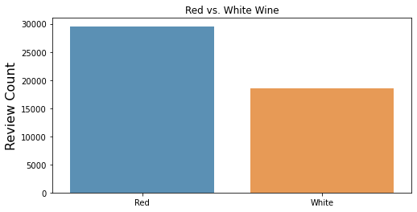
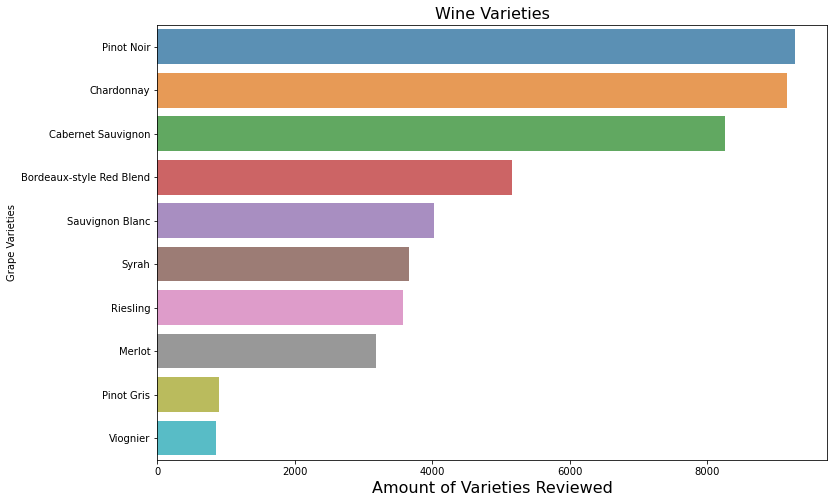
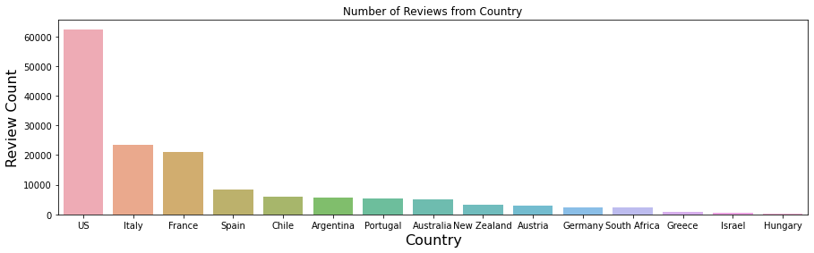
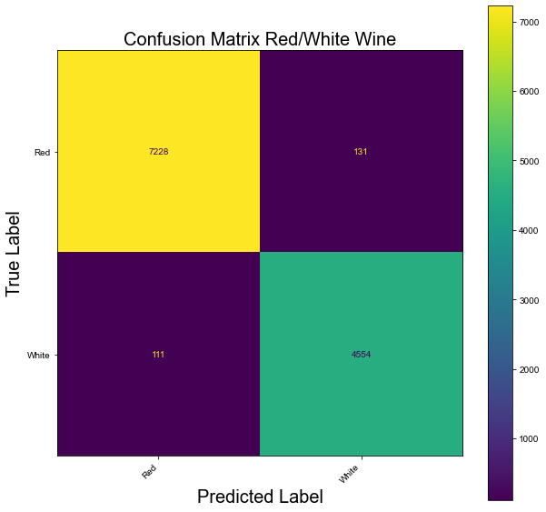
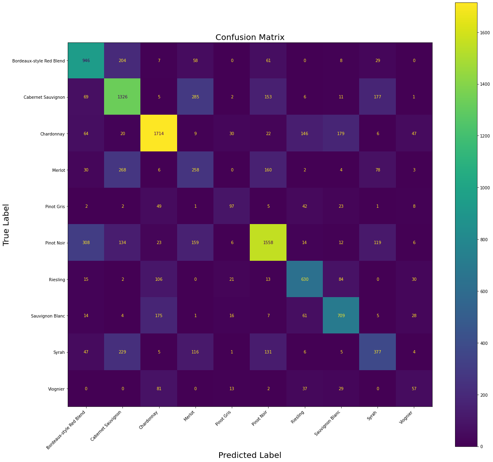

# Wine Predictor

## The Project

I wanted to be able to predict the variety of wine based on it’s description by examining keywords and characteristics of the wine. I also created a predictor that predicts whether the wine is red or white through the same process of examining keywords and characteristics. I examined wine reviews using natural language processing(NLP). I love wine, so I thought this would be interesting for me to learn more about key characteristics of different types of wine. 

## The Data

My comes from Wine Enthusiast Magazine where zackthoutt scraped wine reviews from their website. This is a link where the dataset can be found: https://www.kaggle.com/zynicide/wine-reviews. For my project, I narrowed down the wine reviews from 150K to 48K because I wanted to use the top 5 most popular red and the top 5 most popular white wines from the dataset. There were 29,562 red wines and 18,533 white wines in my final 48K. 

## The Predictors

### Count Vectorizer using Multinomial Naive Bayes (Red VS White Wine)

This predictor uses a count vectorizer and then multinomial naive bayes to predict whether the wine review is referring to a red or white wine. This model’s accuracy is 98%. I was curious about which keywords the model was using to make it’s predictions, so I pulled out the top features in the reviews. These are some of the top feature words for red wine: Tannins, cherry, black, rich, blackberry, soft, berry, dark, chocolate, spice. 
The top words for white wine: Apple, citrus, crisp, peach, green, fresh, rich, lemon, pear, lime, pineapple.

### Count Vectorizer using Multinomial Naive Bayes (Wine Variety)

This predictor also uses a count vectorizer and multinomial naive bayes to predict the wine variety. This model’s accuracy is 64%. I examined some of the keywords when predicting the wine varieties, and there are many words that overlap within the red and white varieties, and this is limiting the model's accuracy. 

### Random Forest Classifier (Wine Variety)

I chose to create this model because I wanted to see if the accuracy score would improve, and the accuracy using a Random Forest model was higher at 68%. I did a forest of 500 trees and the accuracy never changed much past this point. With the previous model, the keyword overlap between the varieties within red and white wines is causing misclassification. 

## Going Forward

I would want to examine whether red or wine wines were being predicted more accurately, and I would also want to find more unique features of each variety to improve the accuracy of the model. Adding more wine varieties to the final dataset would make the model more advanced rather than just using popular wine varieties. 